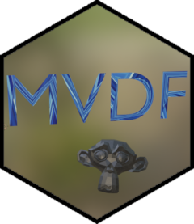

<!-- README.md is generated from README.Rmd. Please edit that file -->

# mvdf <a href='https://mikemahoney218.github.io/mvdf'></a>

<!-- badges: start -->

[](https://www.tidyverse.org/lifecycle/#experimental)
[](https://www.repostatus.org/#wip)
[](https://CRAN.R-project.org/package=mvdf)
[](https://github.com/mikemahoney218/mvdf/actions)
[](https://github.com/mikemahoney218/mvdf/actions)
[](https://codecov.io/gh/mikemahoney218/mvdf)
[](https://choosealicense.com/licenses/mit/)
<!-- badges: end -->

The goal of mvdf is to provide a standardized approach to using R as a
frontend for the [Blender](https://www.blender.org/) 3D rendering
program.

Please note that this package is in early development; breaking changes
can and will happen as better approaches become evident.

## Installation

You can install the development version of `mvdf` from GitHub via:

``` r
remotes::install_github("mikemahoney218/mvdf")
```

You’ll also need to install [Blender](https://www.blender.org/download/)
separately.

## What’s an MVDF anyway?

The `mvdf` package proposes a standard approach to using R as a frontend
interface for the Blender 3D rendering program. By breaking the
development of rendering into three distinct steps – *importing* data
from disparate sources into a standardized format, *manipulating* that
format through a standard set of tools, and creating 3D renderings from
standardized formats via *exporter* functions – `mvdf` forms the
cornerstone of an easily-extensible framework for producing data-driven
3D renders.

The approach centers around creating special objects from our data that
we can then create renderings. The simplest of these objects is an
`mvdf_obj`, which just needs an x, y, and z position:

``` r
library(mvdf)
iris_mvdf <- mvdf_obj(
  data = iris, 
  x = Sepal.Length,
  y = Sepal.Width,
  z = Petal.Length
)
```

With our object successfully created, we can then chain together a few
functions to make a Python script that will render our data when run
inside Blender:

``` r
library(magrittr) # For the %>% pipe

render_script <- 
  # Delete placeholder objects and import standard Python modules
  create_blender_frontmatter() %>%
  # Add cubes at each point in space in our mvdf
  add_mesh_primitive(object = iris_mvdf,
                     primitive = "cube", 
                     size = 0.2) %>% 
  # Save the output to save_render.blend
  add_blender_endmatter(filepath = "save_render.blend") 
```

And we can then execute that script from R using `execute_render`:

``` r
execute_render(render_script)
```

This script will produce a Blender file (“save\_render.blend”) with
cubes at each point in space specified in our mvdf, with the end result
looking something like this:

``` r
knitr::include_graphics("vignettes/iris_cubes.jpg")
```


For more information, check out the [introductory
vignette!](https://mikemahoney218.github.io/mvdf/articles/intro-to-mvdf.html)
