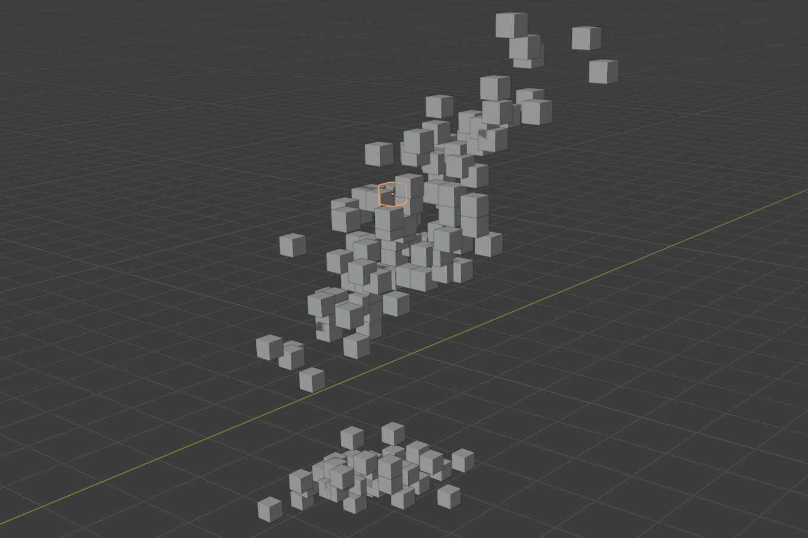

```{r, include = FALSE}
knitr::opts_chunk$set(
  collapse = TRUE,
  comment = "#>"
)
```

## A Minimal Viable Data Format for Using R as a Frontend for Blender

The history of 3D graphics in R is almost as long as the history of R itself, 
spanning from [lattice graphics](https://cran.r-project.org/package=lattice) 
(which gained 3D visualizations sometime around 2001-2002) to 
[rgl](https://cran.r-project.org/package=rgl) (whose oldest source on CRAN dates
back to 2004) to newer implementations such as 
[anglr](https://github.com/hypertidy/anglr), 
[ggrgl](https://github.com/coolbutuseless/ggrgl), and
[rayshader](https://www.rayshader.com/)/[rayrender](http://www.rayrender.net/).
Each of these fantastic packages can be used to produce beautiful 3D 
visualizations from data, with the processing and rendering happening right 
inside your R session.

`mvdf` is a little bit different. Rather than visualize your data itself, `mvdf`
outsources the work, helping you use R as a frontend for the 
[Blender 3D rendering engine](https://www.blender.org/), translating data 
between analysis and visualization steps. As 
[the rayshader documentation says](https://www.tylermw.com/3d-ggplots-with-rayshader/),
learning about programming, data science, and data visualization is hard enough: 
we don't need to add Blender to the list. `mvdf` aims to help you build 
all sorts of visualizations from almost any input data with the same set of 
generic tools, without needing to get into the weeds of 3D rendering technology.

While `mvdf` is a relatively low-level package designed for developers (and 
check out the `mvdf for Developers` vignette for more information on that), this
guide walks through the basic steps of getting from data to visualization, with
pointers to documentation on how to make more complex renders. 
Note that all of our examples from here on out expect that you've already 
installed Blender ([version 2.80 or up](https://www.blender.org/download/)) and 
mvdf (via `remotes::install.github("mikemahoney218/mvdf")`). 

## So What's an `mvdf` Anyway?

A `mvdf` is a _minimum viable data format_ for 3D rendering -- that is, it's a 
data frame that contains _at least_ the bare minimum amount of information 
required to produce a render. For the simplest renders, that generally means 
having x, y, and z coordinates, as well as a unique identifier, for each object
to be drawn. We'll call any object that contains at least that `mvdf` an "`mvdf` 
object" from here on out, and we can create one using `mvdf_obj`:

```{r setup, message=FALSE}
library(mvdf)
library(dplyr) # For demonstration purposes only -- not required by mvdf!
iris %>% 
  mvdf_obj(
    x = "Sepal.Length",
    y = "Sepal.Width",
    z = "Petal.Length") %>% 
  head()
```

As you can see, our `mvdf_obj` only contains that minimal set of data needed to 
make a 3D visualization (plus an index column that's been calculated for us). If
we don't want to lose the other fields in our data frame, we can include any 
tabular data we want in the special `metadata` field of `mvdf_obj`:

```{r}
iris_mvdf <- iris %>% 
  mvdf_obj(
    x = "Sepal.Length",
    y = "Sepal.Width",
    z = "Petal.Length",
    metadata = iris)

head(iris_mvdf)
```

We can also store non-tabular data in the `appendix` slot of `mvdf_obj`, letting
us preserve all our data in a single object. By working with the "getter" 
and "setter" methods provided by the package, we can manipulate these fields 
just like we would any other data frame:

```{r}
iris_mvdf %>% 
  mvdf() %>% # Retrieve the mvdf from iris_mvdf
  merge(
    metadata(iris_mvdf), # Getter methods also exist for metadata and appendix
    by = "idx"
    ) %>% 
  mutate(x = ifelse(Species == "setosa", 0, x)) %>% 
  set_mvdf(iris_mvdf) %>% # Setters set_metadata and set_appendix also exist
  head()
```

So why use `mvdf` objects? The simple answer is that `mvdf` objects are designed
to be a "contract" defining how different rendering methods should interact with
your data. For instance, if we run `?mvdf_obj` we can see that `x`, `y`, and `z`
are all defined as follows:

```
Numeric: distance of the origin of the object from the origin of the grid system 
(the central point at 0, 0, 0) in meters in the given direction. Must have no 
`NA`, `NULL`, `NaN`, `Inf`, or `-Inf` values. [...] Coordinates are assumed to 
be on a right-handed coordinate system with Z oriented as the natural 
"vertical" direction.
```

All `mvdf` objects that have these fields (which, in this case, is all of them) 
agree to this same definition. When possible, definitions are checked 
automatically when creating an `mvdf`:

```{r}
try(mvdf_obj(x = 1, y = 1, z = NA))
```

And when updating `mvdf` values:

```{r}
temp_mvdf <- iris_mvdf %>% 
  mvdf() %>% 
  mutate(x = NA)

# This is the same as set_mvdf(temp_mvdf, iris_mvdf)
try(mvdf(iris_mvdf) <- temp_mvdf)
```
Not all definitions can be automatically checked (for instance, there's no real
way to tell if your data is oriented correctly or stored in meters). In those 
cases, `mvdf` objects (and rendering methods) expect the inputs to be correct 
without any validation.

## Making Simple Renders

The advantage of this contract is that we can then make renders super easily. 
`mvdf` provides functions to let you interactively build Python scripts which
can then be executed in Blender to produce renders.

The absolute simplest rendering pipeline looks something like this:

```{r}
render_script <- 
  # Delete placeholder objects and import standard Python modules
  create_blender_frontmatter() %>%
  # Add cubes at each point in space in our mvdf
  add_mesh_primitive(object = iris_mvdf,
                     primitive = "cube",
                     size = 0.2) %>% 
  # Save the output to save_render.blend
  add_blender_endmatter(filepath = "save_render.blend")
```

That pipeline produces a Python script that we could then run inside Blender to 
produce our render. If we don't want to boot up Blender, we can also execute the
script in the background (which is a good bit more stable for larger renders) 
using the `execute_render` function:

```{r, eval=FALSE}
execute_render(render_script)
```

This produces an output Blender file (named `save_render.blend`) that we can 
open in Blender to see something like this:

```{r, echo=FALSE, out.width='100%'}

```

## More Complicated Renders

This is neat, but pretty basic. Luckily, `mvdf` is built to be a modular system,
with more complicated data and rendering methods using almost exactly the same 
tools as the most basic renders.

For instance, to color our cubes by species, we need to apply what Blender calls
a "material" to each of our objects. To do that, we can create an 
`mvdf_simple_material` object instead of an `mvdf_obj` and pass a color column
to `diffuse_color`:

```{r}
iris_material <- iris %>% 
  mutate(diffuse_color = case_when(
    Species == "setosa" ~ "blue",
    Species == "versicolor" ~ "red",
    TRUE ~ "green"
  )) %>% 
  mvdf_simple_material(
    x = Sepal.Length,
    y = Sepal.Width,
    z = Petal.Length,
    # We can also leave this blank to use the "diffuse_color" column by default
    diffuse_color = diffuse_color,
    # Transform colors to an RGBA array
    translate_colors = TRUE) 

iris_material %>% 
  head()
```

You'll notice that `mvdf_simple_material` did a few things for us automatically:

* We now have `metallic` and `roughness` columns in our mvdf, even though we 
  didn't specify anything to do with those fields! Because materials in Blender
  have metallic and roughness properties no matter what, `mvdf_simple_material`
  makes it explicit what default level any missing values will be set to.
* Our color inputs of "blue", "red", and "green" were translated to RGBA arrays
  because we set `translate_colors` to `TRUE`. 
  
Now that we have an `mvdf_simple_material` object, we can use exactly the same
code as above to construct our rendering script. Other than changing the object
we provide `add_mesh_primitive`, this code is exactly the same as above -- 
our functions are able to infer what we want from the class of our provided 
object alone.

```{r}
render_script <- create_blender_frontmatter() %>%
  add_mesh_primitive(object = iris_material, # Replace iris_mvdf here
                     primitive = "cube",
                     size = 0.2) %>% 
  add_blender_endmatter(filepath = "save_render.blend")
```

We execute it the exact same way:

```{r, eval=FALSE}
execute_render(render_script)
```

And our output looks the same, but now is colored by species!

```{r, echo=FALSE, out.width='100%'}
knitr::include_graphics("iris_color.jpg")
```

By creating a specific class from our data, we provide our functions with all 
the information they need to operate. If we decide that we don't want to use 
those fancy colors, we can just cast our data back into `mvdf_obj` format:

```{r}
set_values(iris_material, newclass = "mvdf_obj") %>% 
  head()
```

And those are the basic features included in `mvdf`! If you're looking to extend
these features to create more involved renders, check out the 
`mvdf for Developers` vignette, and happy rendering!
